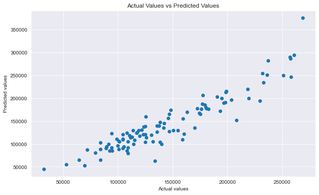

# Problem Statement:

Acclaimed real estate firm House Sellers Plus has had a sudden change in leadership! Following a mid-life crisis executive director Jerry Seller has stepped down. Taking his place is his inexperienced son, Ben Seller. Ben has brought in a data science expert to provide the groundwork on evaluating the value of all the homes currently owned by the firm in Aimes, Iowa.

Thankfully the Ames Assessor’s Office has provided to the firm a collection of data on the sale of houses in the area, which can be used to gain some insight into the housing market in the city.

This project will require the cleaning and use of the Ames housing data set in order to create models that can predict the sale price of a house. After cleaning the data I will use my newly acquired skills of modeling to attempt to find out what features predict the sale price of a house and build a model that can be used to do just that: predict the price of a house.

# Background Research

According to an article written for [Opendoor](https://www.opendoor.com/w/blog/factors-that-influence-home-value#:~:text=The%20local%20market,homes%20it's%20a%20seller's%20market.), a digital platform for buying and selling residential real estate,  two of the most essential factors affecting the price of a house are the overall home size, and the age of the house. Using the data and simple models I will look at how much those two factors hold true to predicting housing prices. I also plan to build a more complex model using much more of the data and other features noted in the article to try to build a more robust model. 

### [Data Dictionary](http://jse.amstat.org/v19n3/decock/DataDocumentation.txt)

# Evaluating the model:

Evaluating the strength of our model, It is clear that there is still room for improvement. Using a different slurry of features and testing other feature combinations could always result in a stronger model. The model also does not seem to be well tuned to dealing with outliers, as the train data which was cleared of outliers almost always outperforms the validation data. Stronger feature engineering could also result in a more robust final model created. Overall though the final model has a R2 score of .86 with a RMSE of 22,000.  Compared to the baseline model which had a R2 score of 0 and a RMSE of 50,000 this model certainly outperforms baseline metrics and shouldn't be completely discounted. It is stronger at predicting prices of lower priced homes, but that could also be because of a limitation in our data. Looking at the graph of actual vs predicted data: 
it is clear that the model is relatively strong, but still has room to improve. This model would work as a groundwork model to pave the way for more robust models.

# Conclusion and Recommendations:

Using several models it is possible to assess the home value of all the homes Ben Seller finds himself suddenly in control of:

1. The overall size of the house is a big determining factor in the price, and the age also has a moderate influence.

2. Factors such as the neighborhood the house is in, the number of fireplaces, and whether or not the house has central air can play a key role in determining house prices.

3. One of the most important features is the overall quality of the house.

This project recommends the following going forward to Mr. Seller:

1. Evaluate the size and location of all of your newly acquired houses to get an estimate of the house's value.

2. With more data an effective model can be built to more accurately predict the price of the houses you are trying to sell.
